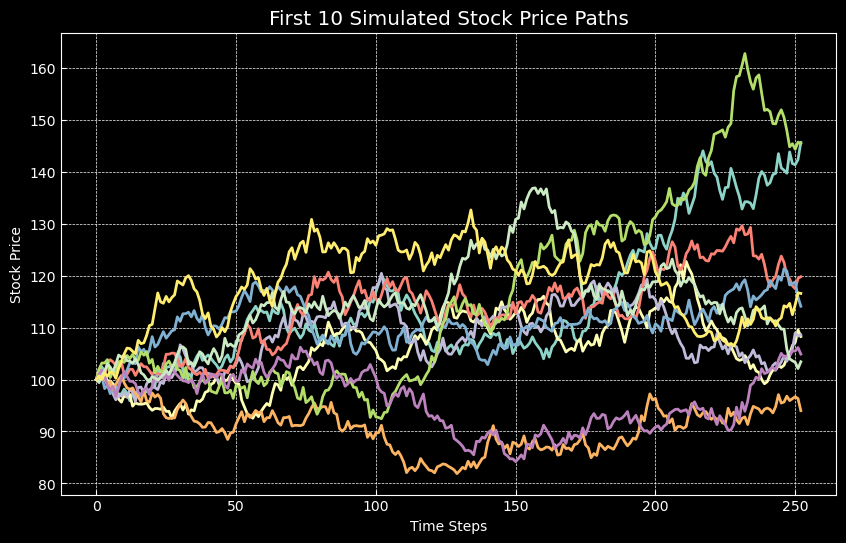
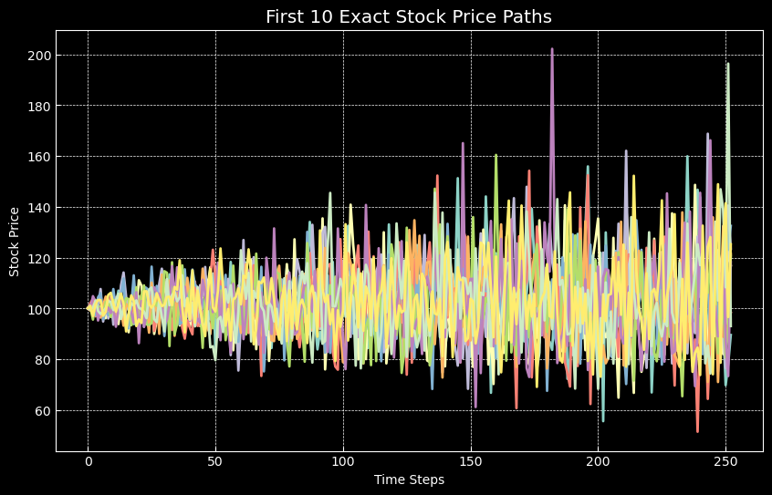
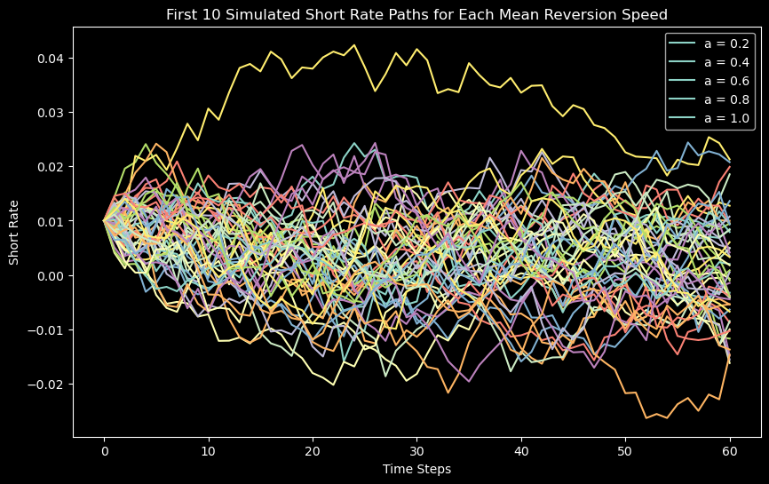
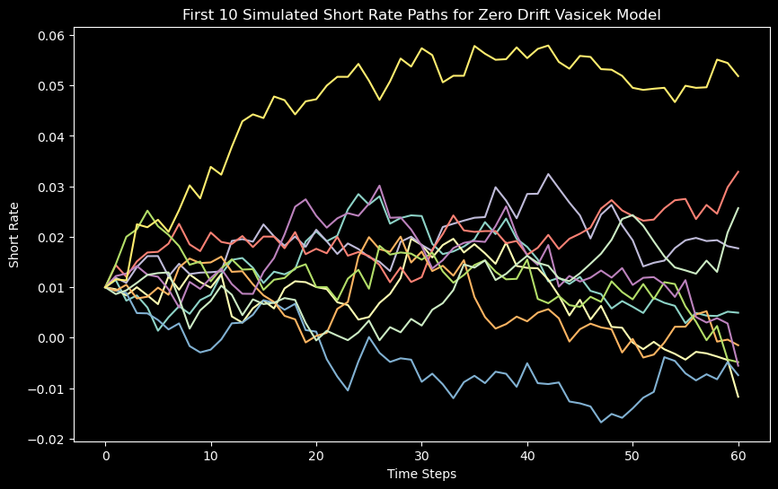

# Monte Carlo Simulation and Option Valuation

This repository contains the implementation of a coursework that was originally supposed to be done in Excel. However, for this project, Python was used instead for more flexibility and automation.

## Part I: Monte-Carlo simulation of stock prices and option valuation

In this part, we simulate stock prices and perform option valuation. The following input data was chosen: today's stock price, the annual risk-free interest rate and the stock's annual volatility. The stock price is simulated once a day for 252 trading days, which equals 1 calendar year in total. The following formula was used for the simulation: 

\[𝑆_𝑡 = 𝑆_{𝑡−1} + 𝜇𝑆_{𝑡−1}𝛥𝑡 + 𝜎𝑆_{𝑡−1}𝜖\sqrt{𝛥𝑡}\]

The drift rate of the stock 𝜇 is set equal to the risk-free rate 𝑟. 𝛥𝑡 is the size of a time step, in this case 𝛥𝑡 = 1/252 and T=1. A random shock 𝜖 is sampled for every time step from the standard normal distribution. This process is repeated to get 1000 simulated stock price paths.

Tasks:
1. Plot the first 10 simulated stock price paths in a diagram.
2. Compute the expected payoff for a call option: \(exp(-r*T)*E[max(S_T-X,0]\). Set X equal to your chosen S0. Start with computing \(max(S_T-X, 0)\) for every \(S_T\) (that is, for every path) and then compute the mean value (the average \(S_T\)) over all 1000 paths. Compute with help of the Black Scholes formula the option price using S0, X and r and compare.
3. The option price computed by simulation in 2. is based on a discretized GBM. Simulate stock price paths and compute the option price using the exact solution for the GBM instead. Compare the option price with the price you found in 2. and with the Black Scholes price.
4. Value an Asian call option (at the money) using your simulated stock price paths (using both discretized GBM and the exact solution for the GBM). Compare.

# Simulation Steps

1. **Set Constants:** We chose the following values:
    - Current stock price (S0) = $100
    - Annual risk-free interest rate (r) = 5%
    - Annual volatility of the stock (sigma) = 20%

2. **Simulate Stock Price Paths:** We simulated the stock price once a day for 252 trading days, using 1000 simulated stock price paths. The formula we used is:

    \(S_t = S_{t-1} + \mu S_{t-1}\Delta t + \sigma S_{t-1}\epsilon \sqrt{\Delta t}\)

3. **Plot Stock Price Paths:** We plotted the first 10 simulated stock price paths. The plot is shown below:

    

4. **Compute Expected Payoff for a Call Option:** We used the formula below to compute the expected payoff for a call option:

    \(\exp(-rT) \times \mathbb{E}[\max(S_T - X, 0)]\)

5. **Compute Option Price using Black-Scholes Formula:** We used the Black-Scholes formula to compute the option price and compared it with the price obtained from the simulation. The Black-Scholes formula we used is:

    \(C = S_0 e^{-qT} N(d1) - X e^{-rT} N(d2)\)

    where

    \(d1 = \frac{\ln \left(\frac{S_0}{X}\right) + \left(r - q + \frac{\sigma^2}{2}\right)T}{\sigma \sqrt{T}}\)

    and

    \(d2 = d1 - \sigma \sqrt{T}\)

6. **Simulate Stock Price Paths using Exact GBM:** We simulated the stock price paths and computed the option price using the exact solution for Geometric Brownian Motion. The formula for the exact GBM is:

    \(S_t = S_0 e^{(r - 0.5\sigma^2)t + \sigma\epsilon\sqrt{t}}\)

    

8. **Compute Value of an Asian Call Option:** We computed the value of an Asian call option using the simulated stock price paths. The payoff at maturity for an Asian call option is:

    \(\max(\bar{S_T} - X, 0)\)
    
## Results

The expected payoff for a call option computed from the Monte Carlo simulation was approximately $10.61, while the option price computed from the Black-Scholes formula was approximately $10.45. The expected payoff for a call option computed using the exact solution for Geometric Brownian Motion was approximately $11.05. The expected payoff for an Asian call option computed using the discretized Geometric Brownian Motion paths was approximately $5.91, while the expected payoff computed using the exact Geometric Brownian Motion paths was approximately $2.38.

## Part II: Monte-Carlo simulation of interest rates and valuation of interest rate caps

In this part, the Vasicek model is used to simulate 100 paths for short rates over 5 years (sampling once a month and setting the long run mean equal to 0). This is done for a total of 5 different mean reversion speeds.

Tasks:
1. Simulate short rate paths and plot the sample paths.
2. The parameters for the Vasicek model are hard to estimate with empirical data. What is the current long run mean? An easier approach would be to simulate a zero drift Vasicek for short rates. Simulate 100 paths for 5 years with monthly sampling (let the process start at r=0.01).
3. Assume the following: you want to buy a new apartment close to your finance job at Stureplan, and assume you can take a 5 million SEK bank loan. The bank charges a 1 percent fee above the monthly short rate (0percent and flat term structure). You prefer floating 1 month rate financing since its currently cheaper. However, you computed that if financing rates rise above 2percent (a doubling), this would affect too much the amount you can spend on restaurants, bars and travels. Hence, you want to buy an interest rate cap at 2percent, so that you can relax and sleep well. What would this cost you (hint: the interest rate cap will exactly offset any payments larger than 2percent of your loan; the risk free discount rate is 0percent)?

# Simulation Steps

1. **Set Constants:** We chose the following values:
    - Short rate volatility (sigma) = 1% per year
    - Initial short rate (r0) = 1%
    - Long-term mean rate (b) = 0 (for the Vasicek model)

2. **Simulate Short Rate Paths Using the Vasicek Model:** We simulated 100 paths for short rates over 5 years, sampling once a month, and we did this for 5 different mean reversion speeds. The Vasicek model is represented by the following stochastic differential equation:

    \(dr_t = a(b - r_t)dt + \sigma dW_t\)

3. **Plot Simulated Short Rate Paths:** We plotted the first 10 simulated short rate paths for each mean reversion speed. The plot is shown below:

    

4. **Simulate a Zero Drift Vasicek Model for Short Rates:** We simulated a zero drift Vasicek model for short rates, simulating 100 paths for 5 years with monthly sampling.

5. **Plot Simulated Short Rate Paths for the Zero Drift Vasicek Model:** We plotted the first 10 simulated short rate paths for the zero drift Vasicek model. The plot is shown below:

    

6. **Compute the Cost of an Interest Rate Cap:** We computed the cost of an interest rate cap that will offset any payments larger than 2% of a 5 million SEK loan. The cost of the cap is the sum of the expected payments, where each payment is computed as:

    \(\max(r_t - (cap\_rate - bank\_fee), 0) \times loan\_amount \times \Delta t\)

## Results

The cost of the interest rate cap that will offset any payments larger than 2% of a 5 million SEK loan is approximately 16,053,285 SEK. This represents the total amount you would need to pay over the 5-year period to ensure your interest payments do not exceed 2% per month.

Please note that this is a simplified calculation and actual pricing of interest rate caps in the financial market involves more complex models and considerations, including but not limited to, counterparty credit risk, market risk, and liquidity risk.

